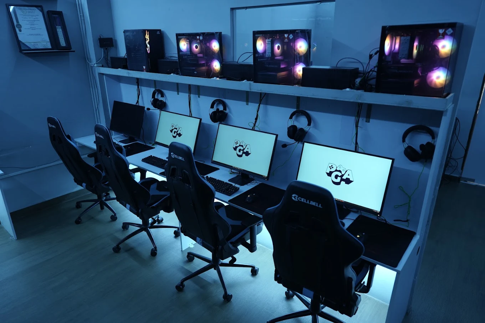

# Pulse Gaming Arena — Mylapore, Chennai

> Chennai's premier cyber lounge & esports destination. High-performance 240 FPS PC rigs, PS5 squad lounges, MOZA sim racing cockpits, and private gaming suites.



## ⚡ Highlights & Features

- **240 FPS PC Rigs**: High-refresh competitive monitors, ultra-responsive mechanical peripherals, and pre-installed competitive titles (Valorant, CS2, League, Dota 2, Apex Legends).
- **PS5 Squad Lounge**: Big-screen 4K console gaming with dual screen setups and plush sofa seating.
- **MOZA Sim Racing Division**: Direct-drive force feedback racing wheel, precision pedals, and full race cockpit.
- **Private Squad Rooms**: Exclusive room reservations for squad scrims, private tournaments, and birthday celebrations.
- **Tournament Arena**: Regular community cups, leaderboards, and prize pools.

---

## 🛠️ Built With

- **HTML5**: Semantic tags, OpenGraph SEO metadata, accessible ARIA dialog modals.
- **Vanilla CSS3**: CSS custom design variables, responsive grid & flexbox layouts, custom dark cyberpunk aesthetics, smooth animations.
- **JavaScript (ES6+)**: Custom Lerp cursor tracking, IntersectionObserver scroll animations, modal dialog managers, mobile navigation drawer, and touch/button review carousel.

---

## 📂 Project Structure

```
.
├── index.html        # Main landing page markup & modals
├── style.css         # Design tokens, responsive rules & keyframe animations
├── script.js         # Interactive cursor, scroll reveals, modal & gallery logic
├── README.md         # Project documentation
├── .gitignore        # Git ignore directives
└── assets/           # High-resolution media & artwork
    ├── entry.png
    ├── logo.png
    ├── pc-close.png
    ├── pc-play.png
    ├── pc-wide.png
    ├── ps5-crowd.png
    ├── ps5-dual.png
    ├── ps5-game.png
    ├── ps5-lounge.png
    └── simulator.png
```

---

## 🚀 Live Preview & Running Locally

1. Clone or download the repository:
   ```bash
   git clone https://github.com/ALLaNRoY-TECH/pulsedemo1.git
   cd pulsedemo1
   ```
2. Open `index.html` directly in any modern browser, or launch using a local server (e.g. VS Code Live Server or `npx serve .`).

---

## 📝 License & Credits

Designed & Developed for **Pulse Gaming Arena**, Mylapore, Chennai.  
© 2026 Pulse Gaming Arena. All rights reserved.
